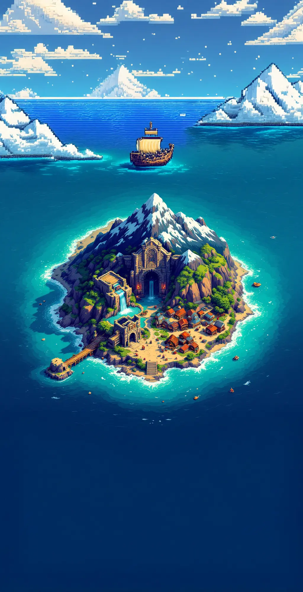
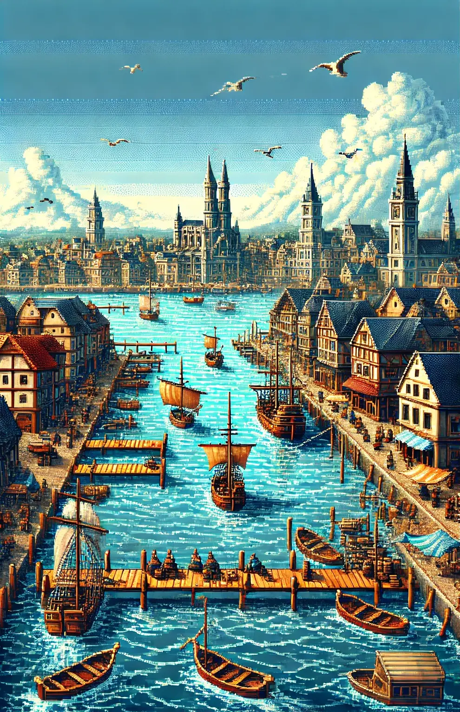
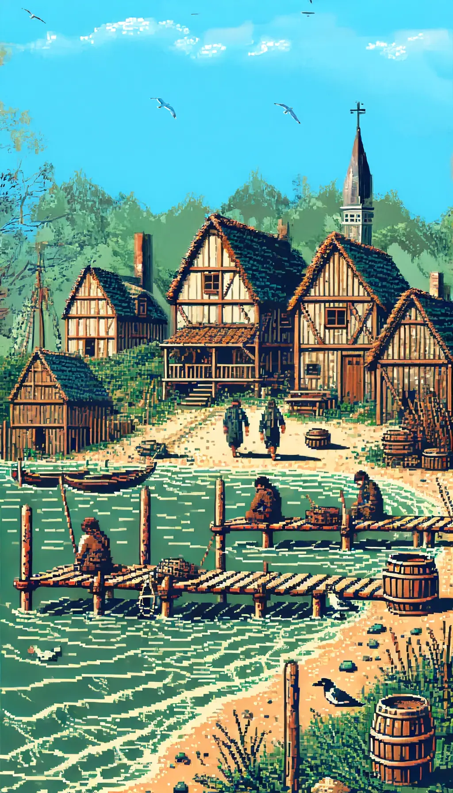
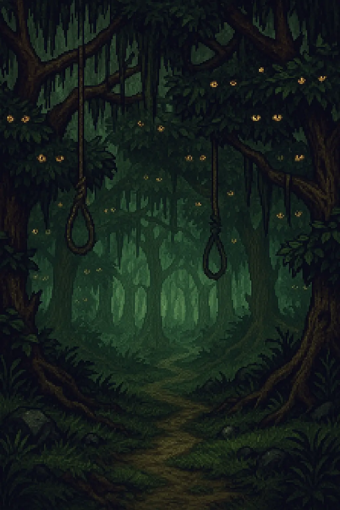
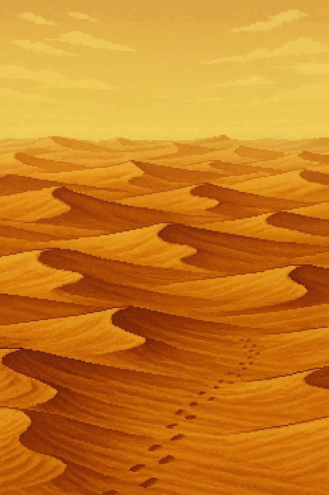
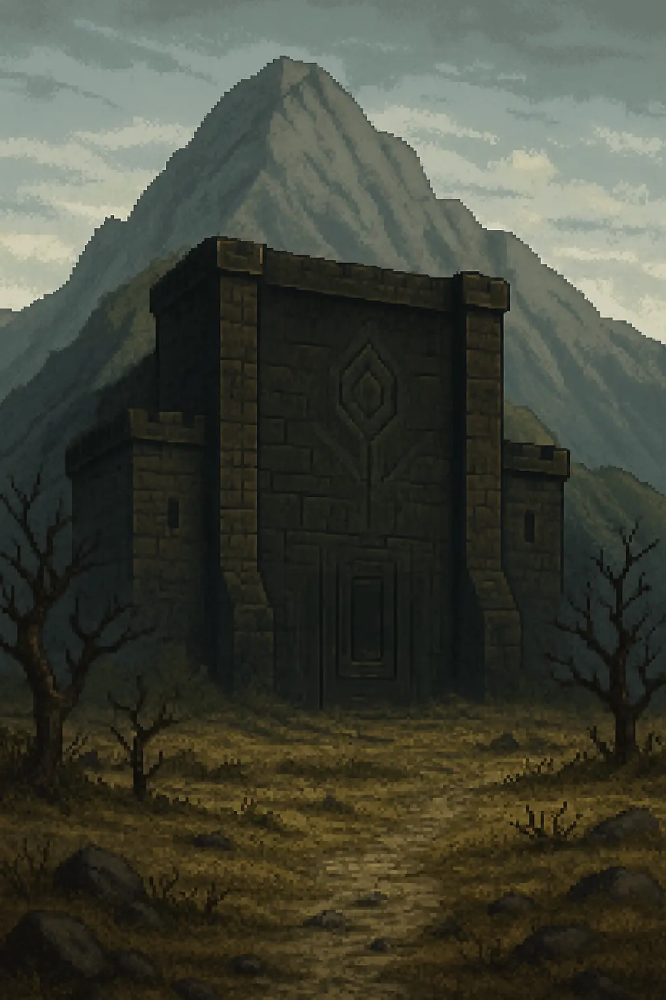

# 🏰 Fiche Royaume : L'Île du Nord

| Informations                                                                                                                                                                                                                                                                                                                                                                                                  | Image                                                                                            | Carte                                                                                       |
|---------------------------------------------------------------------------------------------------------------------------------------------------------------------------------------------------------------------------------------------------------------------------------------------------------------------------------------------------------------------------------------------------------------|--------------------------------------------------------------------------------------------------|---------------------------------------------------------------------------------------------|
| **Type de lieu** : Royaume  **Localisation** : Les Huit Royaumes  **Description** : Le Royaume de l’Île du Nord est un territoire vaste et ancien, composé de lieux aussi variés que dangereux. On y trouve des ports commerçants, des montagnes oubliées, des déserts hantés, et même un donjon légendaire. De nombreuses rumeurs circulent sur son passé, ses rois, et les mystères qui s’y cachent encore. |  |  |

---

## 🗺️ Port Saint-Doux

**Type de lieu** : Ville  
**Localisation** : Royaume de l’Île du Nord  
**Description** :
> Port Saint-Doux est la capitale de l'Île du Nord, un port prospère et cosmopolite où se croisent marchands,
> aventuriers et marins en quête de fortune. La ville est dirigée par le Maire, un homme suffisant et ambitieux, qui ne
> recule devant rien pour maintenir son pouvoir et sa richesse.

| Quartiers            | Bâtiments                                           | PNJs/Créatures présents                                                            |
|----------------------|-----------------------------------------------------|------------------------------------------------------------------------------------|  
| Quartier du Marché   | *(Aucun)*                                           | Sophie la Marchande, Robert le Garde, Bilo le Passant                              |
| Anciens Docks        | *(Aucun)*                                           | Horde de Rats                                                                      |
| Vieille Ville        | Forge de Port Saint-Doux, Temple de Port Saint-Doux | Gart le Forgeron, Grand-Prêtre                                                     |
| Docks de l'Ouest     | Taverne de la Flûte Moisie                          | Jarrod le Tavernier, Myra la Vieille, Sirène Mélancolique                          |
| Quartier des Ploucs  | Arcanes de Port Saint-Doux                          | Wilbert l'Arcaniste, Pêcheur                                                       |
| Quartier des Chauves | Palais Royal, Hôtel de Ville                        | Garde du Quartier des Chauves, Garde du Palais, Servante, Maire de Port Saint-Doux |
| Nouvelle Ville       | *(Aucun)*                                           | *(Aucun)*                                                                          |

---

## 🗺️ Plouc

**Type de lieu** : Village  
**Localisation** : Royaume de l’Île du Nord  
**Description** :
> Le village de pêcheurs de Plouc est un endroit reculé, situé à quelques lieues de Port Saint-Doux.  
> Les habitants, simples et rustiques, vivent de la pêche et de la chasse, loin de l'agitation de la capitale.  
> Les maisons en bois et en torchis s'alignent le long de la côte, où un semblant d'embarcadère semble servir de port de
> pêche.  
> Les villageois vous regardent d'un air méfiant, et s'en remettent à leurs occupations.

| Quartiers | Bâtiments                   | PNJs/Créatures présents |
|-----------|-----------------------------|-------------------------|  
| *(Aucun)* | Maison de Gérard le Pêcheur | Gérard le Pêcheur       |

---

## 🗺️ Bois des Relents

**Type de lieu** : Forêt  
**Localisation** : Royaume de l’Île du Nord  
**Description** :
> Malgré sa canopée clairsemée et ses sentiers paisibles, une odeur tenace flotte dans l’air du Bois des Relents —
> mélange déroutant de terre détrempée, de mousse pourrissante et de quelque chose d’indéfinissable… comme un vieux
> souvenir oublié dans un coin humide.
> Les habitants de Plouc évitent ces bois dès que le vent tourne, murmurant que les miasmes qui s’en échappent ne sont
> pas tous naturels. Certains disent qu’un ancien marais s’étend sous la surface, d’autres parlent de créatures tapies,
> à l’origine de ces relents peu engageants.

| Zones             | Bâtiments | PNJs/Créatures présents          |
|-------------------|-----------|----------------------------------|  
| Orée du Bois      | *(Aucun)* | Éclaireurs Gobelins              |
| Campement Gobelin | *(Aucun)* | Guerriers Gobelins, Chef Gobelin |

---

## 🗺️ Bois du Pendu

**Type de lieu** : Forêt  
**Localisation** : Royaume de l’Île du Nord  
**Description** :
> Un sous-bois étrange, où les lianes pendent comme des cordes à nœud coulant, et où les feuilles semblent vous
> observer. L’air y est lourd, et le silence… presque vivant.  
> On raconte qu’ici, les morts murmurent aux arbres, et que ceux qui viennent les écouter ne reviennent jamais tout à
> fait les mêmes.

| Zones                 | Bâtiments | PNJs/Créatures présents        |
|-----------------------|-----------|--------------------------------|  
| Clairière de l'Oublié | *(Aucun)* | Théobald Gris-Murmure, Druides |
| Crique du Pendu       | *(Aucun)* | Gérôme le Pendu                |
| Bosquet des Druides   | *(Aucun)* | Grand Druide                   |

---

## 🗺️ Sables Chauds

**Type de lieu** : Désert  
**Localisation** : Royaume de l’Île du Nord  
**Description** :
> Le désert des Sables Chauds s’étend jusqu’à l’horizon, bordé d’un côté par la mer et de l’autre par des falaises
> ocres.
> Les dunes y chantent au moindre souffle du vent. Des mirages dansent à la surface du sable, et les traces de pas
> s’effacent presque aussitôt. C’est un lieu oublié des cartes et des hommes, où les légendes se cachent dans les grains
> brûlants.

| Zones              | Bâtiments | PNJs/Créatures présents                         |
|--------------------|-----------|-------------------------------------------------|  
| Camp Abandonné     | *(Aucun)* | Farouk le Nomade                                |
| Oasis Sans Nom     | *(Aucun)* | Le Faux Djinn                                   |
| Plage de la Sirène | *(Aucun)* | Squelette d'Eryl le Traître, Squelette de Marin |

---

## 🗺️ Monts Terribles

**Type de lieu** : Montagnes  
**Localisation** : Royaume de l’Île du Nord  
**Description** :
> Les Monts Terribles dressent leurs cimes déchiquetées au centre de l'île. Aucun sentier sûr ne serpente entre leurs
> parois abruptes, et les voyageurs y avancent à leurs risques et périls, au milieu des bourrasques glaciales et des
> éboulis traîtres. Autrefois, les nains y extrayaient de précieux minerais, mais leurs mines ont été abandonnées, et
> nul ne sait vraiment pourquoi. On raconte que les pierres elles-mêmes hurlent lorsque le vent se lève…

| Zones                  | Bâtiments  | PNJs/Créatures présents                |
|------------------------|------------|----------------------------------------|  
| Col du Vent Noir       | *(Aucun)*  | *(Aucun)*                              |
| Grotte des Échos       | La Grotte  | Bardin l'Exhumé                        |
| Refuge du Bouc Boiteux | Le Refuge  | Tharôl le Silencieux, Bouquetin Féroce |
| Gouffre d'Askalor      | Le Gouffre | Nains du Culte de l'Âtre Souverain     |
| Rocher du Dragon       | *(Aucun)*  | *(Aucun)*                              |

---

## 🗺️ Donjon de l'Âme

**Type de lieu** : Donjon  
**Localisation** : Royaume de l’Île du Nord  
**Description** :
> Adossé au flanc nord des Monts Terribles, le Donjon de l’Âme projette son ombre sur tout le royaume. Sa silhouette
> noire, anguleuse, semble avoir poussé de la montagne comme une excroissance malade. Personne ne sait qui l’a bâti, ni
> pourquoi, mais tous savent qu’il vaut mieux ne pas s’en approcher. Les légendes parlent de voix qui chuchotent dans le
> vent, de lumières qui dansent derrière les meurtrières, et de voyageurs jamais revenus.
> Ses portes sont introuvables pour les yeux profanes, dissimulées par d’antiques sortilèges oubliés. Et même si on les
> trouvait… encore faudrait-il les ouvrir.

| Zones/Pièces           | Bâtiments | PNJs/Créatures présents |
|------------------------|-----------|-------------------------|  
| Entrée du Donjon       | *(Aucun)* | *(Aucun)*               |
| Hall d'Entrée          | *(Aucun)* | *(Aucun)*               |
| Salle des Chaînes      | *(Aucun)* | *(Aucun)*               |
| Salle du Miroir        | *(Aucun)* | *(Aucun)*               |
| Salle des Murmures     | *(Aucun)* | Galdric III             |
| Crypte Inversée        | *(Aucun)* | *(Aucun)*               |
| Antichambre du Roi     | *(Aucun)* | Alaric                  |
| Tombeau de Galdric 1er | *(Aucun)* | Nashoré                 |
