# 📍 Fiche Lieu : Port Saint-Doux

**Type de lieu** : Ville  
**Localisation** : Royaume de l’Île du Nord  
**Description** :
> Port Saint-Doux est la capitale de l'Île du Nord, un port prospère et cosmopolite où se croisent marchands,
> aventuriers et marins en quête de fortune. La ville est dirigée par le Maire, un homme suffisant et ambitieux, qui ne
> recule devant rien pour maintenir son pouvoir et sa richesse.

---

## 🗺️ Quartier du Marché

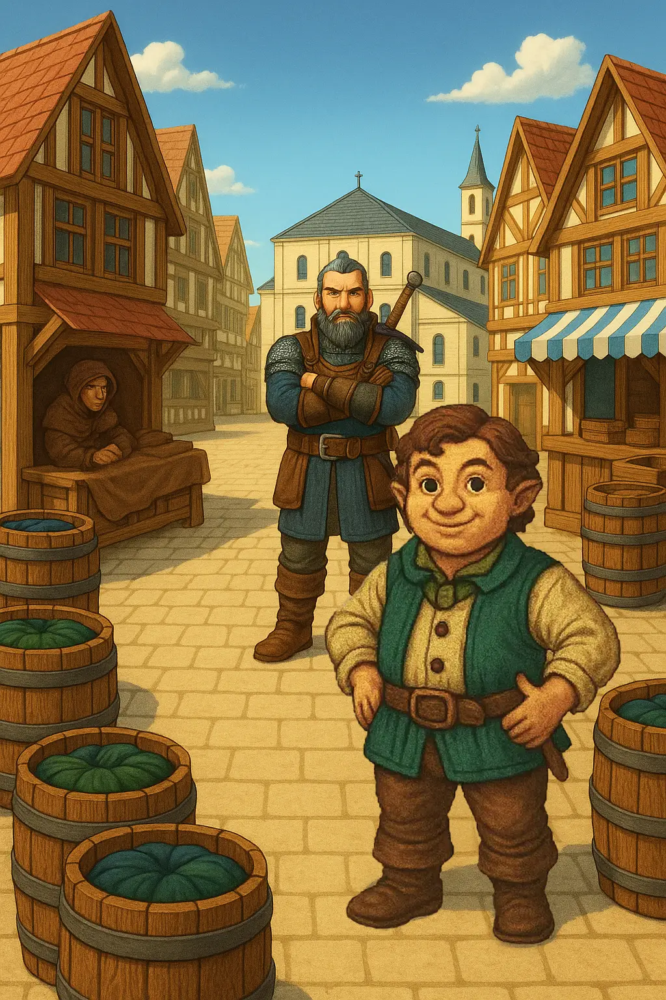

**Type de lieu** : Quartier  
**Localisation** : Port Saint-Doux  
**Description** :
> Quartier animé où se croisent les commerçants, les badauds et les nouvelles de tout le royaume.

| PNJs présents       | Bâtiments |  
|---------------------|-----------|  
| Sophie la Marchande | *(Aucun)* |  
| Robert le Garde     |           |  
| Bilo le Passant     |           |  

---

## 🗺️ Anciens Docks

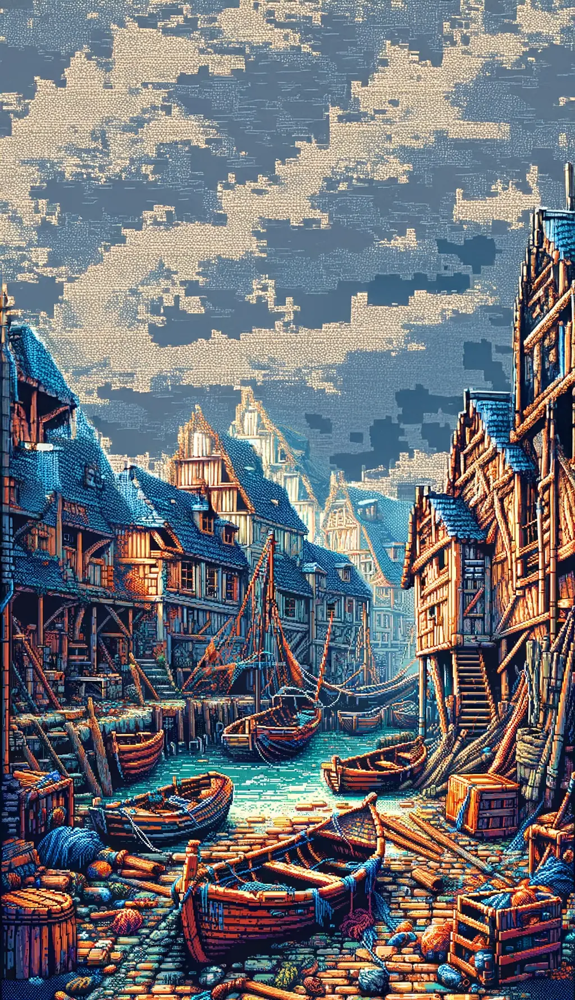

**Type de lieu** : Quartier  
**Localisation** : Port Saint-Doux  
**Description** :
> Ancienne zone de déchargement, aujourd’hui abandonnée. Les rats y pullulent.

| Créatures présentes | Bâtiments |  
|---------------------|-----------|  
| Horde de rats       | *(Aucun)* |  

---

## 🗺️ Vieille Ville

**Type de lieu** : Quartier  
**Localisation** : Port Saint-Doux  
**Description** :
> Cœur historique de la ville, entre ruelles pavées et bâtisses anciennes.

| PNJs présents | Bâtiments                 |  
|---------------|---------------------------|  
| *(Aucun)*     | Forge de Port Saint-Doux  |
|               | Temple de Port Saint-Doux |

### 🏛️ Forge de Port Saint-Doux

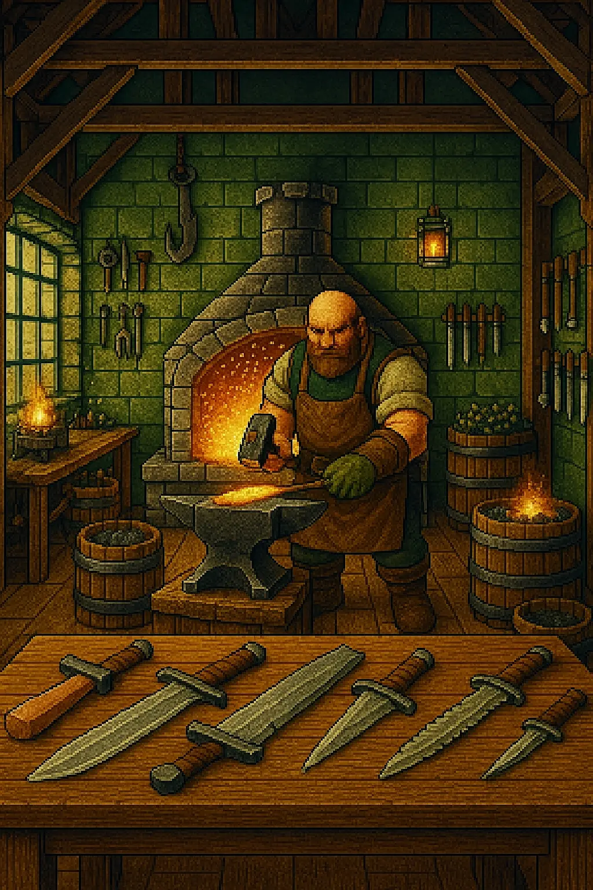

**Type de lieu** : Bâtiment  
**Localisation** : Vieille Ville  
**Description** :
> Forge artisanale où le forgeron travaillent le métal avec passion.

| PNJs présents    | Pièces     |  
|------------------|------------|  
| Gart le Forgeron | *(Aucune)* |  

### 🏛️ Temple de Port Saint-Doux

**Type de lieu** : Bâtiment  
**Localisation** : Vieille Ville  
**Description** :
> Sanctuaire dédié aux divinités maritimes, lieu de prière et de méditation.

| PNJs présents                   | Pièces     |  
|---------------------------------|------------|  
| Grand-Prêtre de Port Saint-Doux | *(Aucune)* |  

---

## 🗺️ Docks de l’Ouest

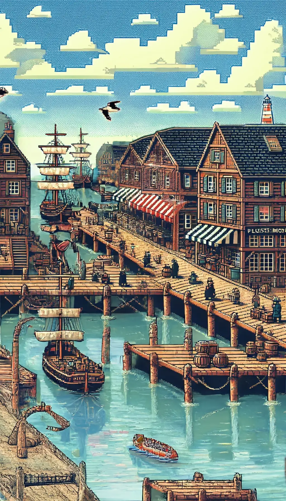

**Type de lieu** : Quartier  
**Localisation** : Port Saint-Doux  
**Description** :
> Port secondaire où les murmures de la mer rencontrent les secrets anciens.

| PNJs présents          | Bâtiments                  |  
|------------------------|----------------------------|  
| La Sirène Mélancolique | Taverne de la Flûte Moisie |  

### 🏛️ Taverne de la Flûte Moisie

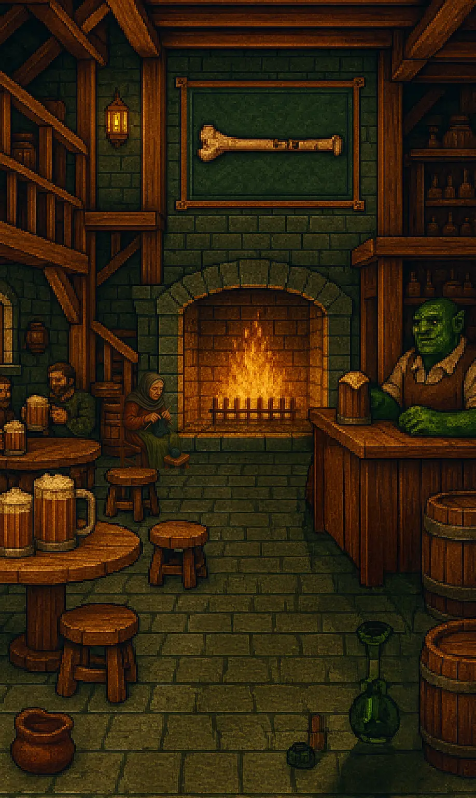

**Type de lieu** : Bâtiment  
**Localisation** : Docks de l’Ouest  
**Description** :
> Taverne populaire où les marins se retrouvent pour partager leurs histoires et leurs boissons

| PNJs présents       | Pièces     |  
|---------------------|------------|  
| Jarrod le Tavernier | *(Aucune)* |  
| Myra la Vieille     |            |  

---

## 🗺️ Quartier des Ploucs

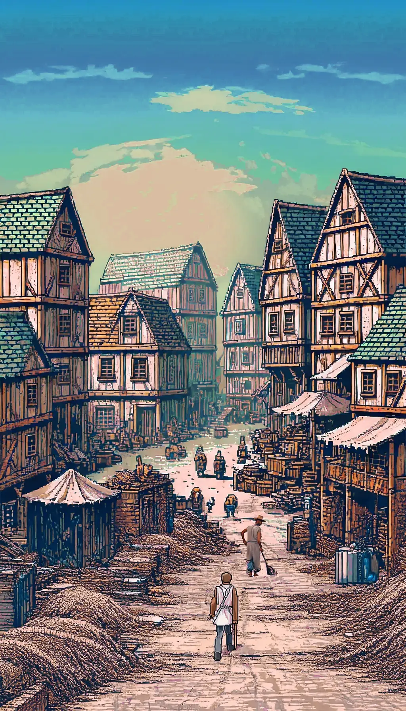

**Type de lieu** : Quartier  
**Localisation** : Port Saint-Doux  
**Description** :
> Quartier plus pauvre mais vivant, proche des pêcheurs et des rumeurs de la mer.

| PNJs présents | Bâtiments                  |  
|---------------|----------------------------|  
| Le Pêcheur    | Arcanes de Port Saint-Doux |  

### 🏛️ Arcanes de Port Saint-Doux

**Type de lieu** : Bâtiment  
**Localisation** : Quartier des Ploucs  
**Description** :
> Boutique d’objets magiques et de potions, tenue par un arcaniste excentrique.

| PNJs présents       | Pièces     |  
|---------------------|------------|  
| Wilbert l’Arcaniste | *(Aucune)* |  

---

## 🗺️ Quartier des Chauves

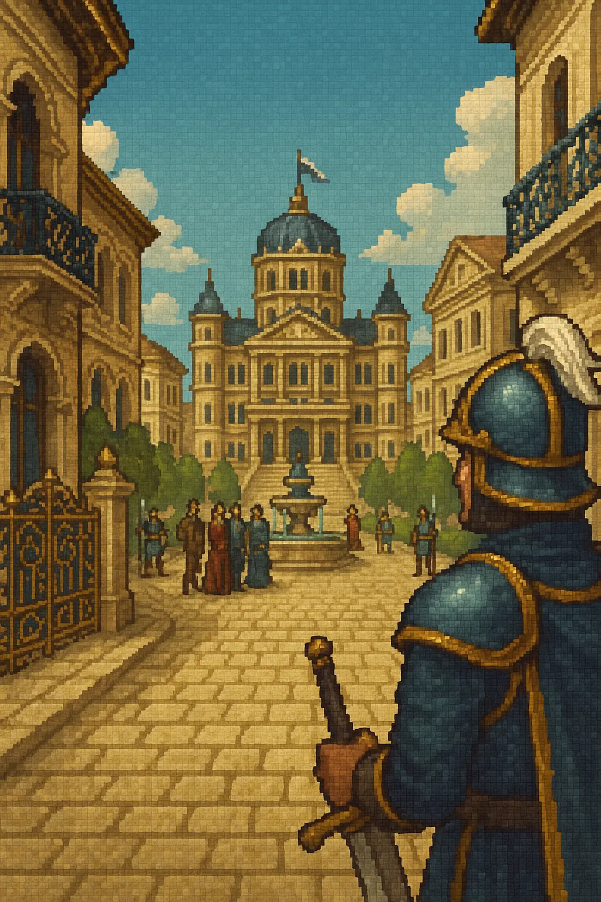

**Type de lieu** : Quartier  
**Localisation** : Port Saint-Doux  
**Description** :
> Centre politique de la ville, riche et bien gardé.

| PNJs présents                 | Bâtiments      |  
|-------------------------------|----------------|  
| Garde du Quartier des Chauves | Palais Royal   |  
|                               | Hôtel de Ville |  

### 🏛️ Palais Royal

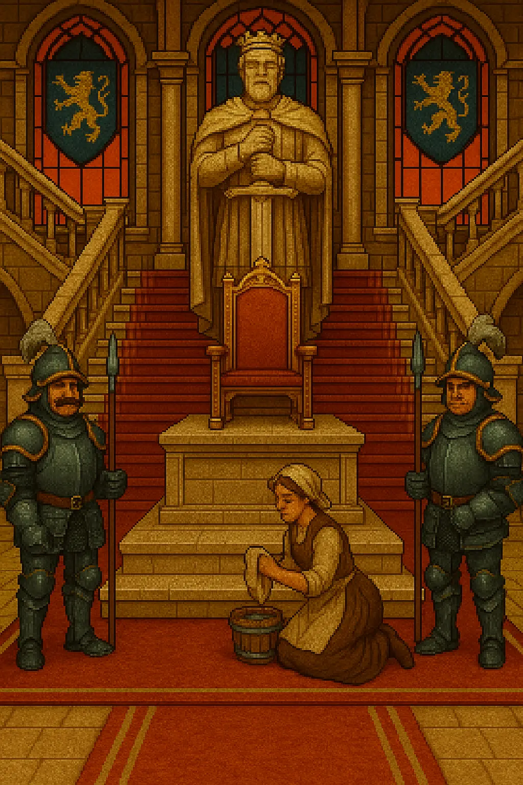

**Type de lieu** : Bâtiment  
**Localisation** : Quartier des Chauves  
**Description** :
> Résidence du Roi Galdric III et du Prince Alaric, le Palais Royal est un symbole de pouvoir et de richesse.

| PNJs présents   | Pièces              |  
|-----------------|---------------------|  
| Garde du Palais | Appartements Royaux |  
| Servante        |                     |  

#### 🧱 Appartements Royaux

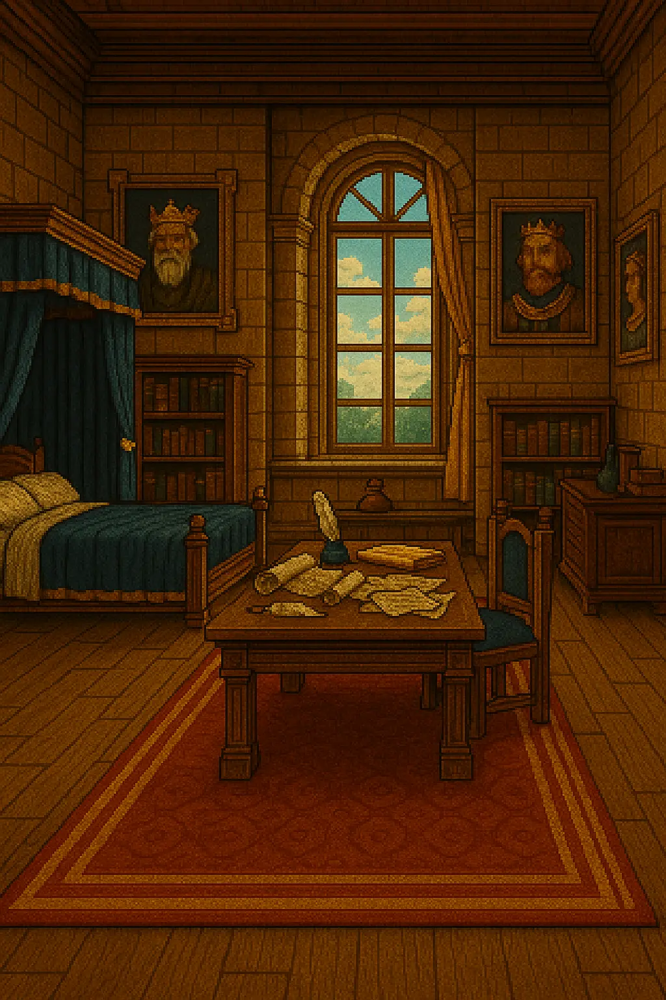

**Type de lieu** : Pièce  
**Localisation** : Palais Royal
**Description** :
> Luxueux appartements privés du Roi, ornés de trésors et de souvenirs royaux.

| PNJs présents |  
|---------------|  
| *(Aucun)*     |  

### 🏛️ Hôtel de Ville

**Type de lieu** : Bâtiment  
**Localisation** : Quartier des Chauves  
**Description** :
> Lieu de réunion des autorités locales, l'Hôtel de Ville est le centre névralgique de la politique de Port Saint-Doux.

| PNJs présents | Pièces               |  
|---------------|----------------------|  
| Le Maire      | Jardins de la Mairie |  

#### 🧱 Jardins de la Mairie

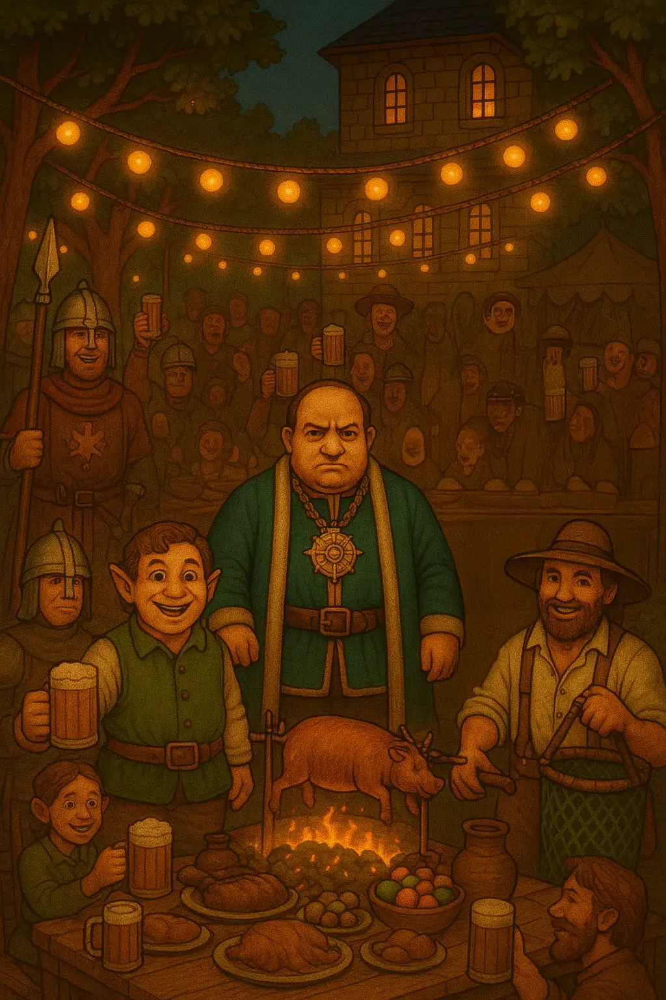

**Type de lieu** : Pièce  
**Localisation** : Hôtel de Ville  
**Description** :
> Jardins entretenus de l'Hôtel de Ville, un havre de paix au cœur de la ville.

| PNJs présents |  
|---------------|  
| *(Aucun)*     |  

---

## 🗺️ Nouvelle Ville

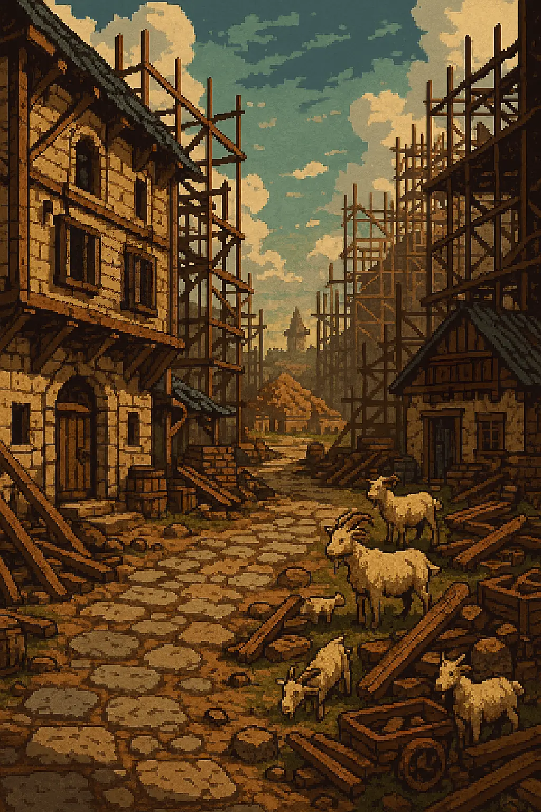

**Type de lieu** : Quartier (en construction)  
**Localisation** : Port Saint-Doux  
**Description** :
> Nouveau quartier ambitieux dont les fondations promettent un avenir incertain.

| PNJs présents | Bâtiments |  
|---------------|-----------|  
| *(Aucun)*     | *(Aucun)* |
