# 📍 Fiche Lieu : Monts Terribles

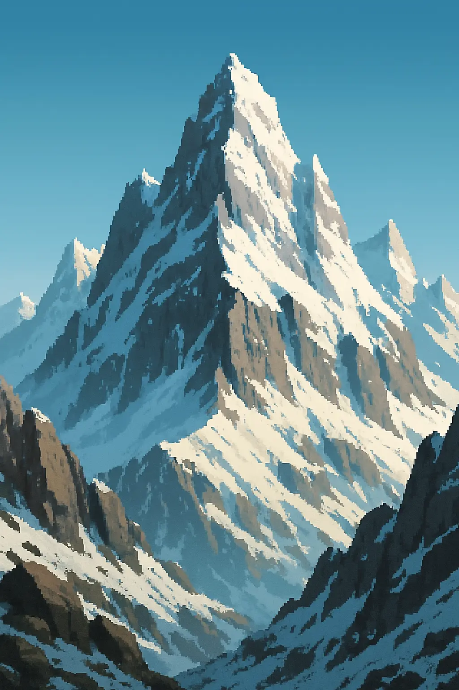

**Type de lieu** : Montagnes  
**Localisation** : Royaume de l’Île du Nord  
**Description** :
> Les Monts Terribles dressent leurs cimes déchiquetées au centre de l'île. Aucun sentier sûr ne serpente entre leurs
> parois abruptes, et les voyageurs y avancent à leurs risques et périls, au milieu des bourrasques glaciales et des
> éboulis traîtres. Autrefois, les nains y extrayaient de précieux minerais, mais leurs mines ont été abandonnées, et
> nul ne sait vraiment pourquoi. On raconte que les pierres elles-mêmes hurlent lorsque le vent se lève…

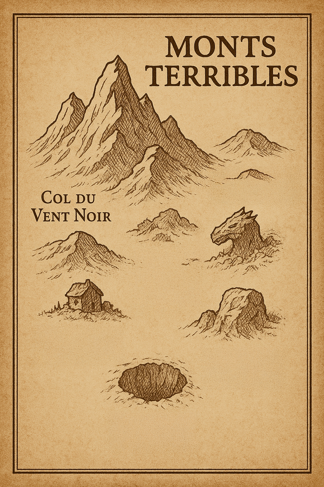

---

## 🗺️ Col du Vent Noir

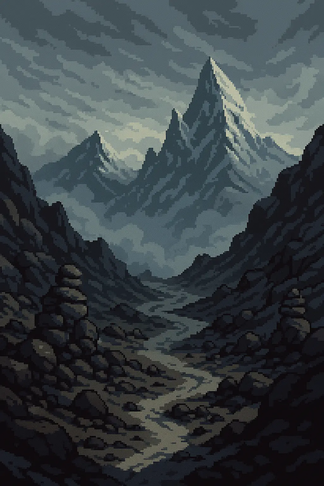

**Type de lieu** : Zone  
**Localisation** : Monts Terribles  
**Description** :
> Premier passage vers les hauteurs des Monts Terribles, le Col du Vent Noir est balayé par des bourrasques si violentes
> qu’elles emportent parfois les plus imprudents dans le vide. Aucun arbre ne pousse ici, seulement des pierres battues
> par les intempéries et des vestiges d’anciens cairns, empilés par des voyageurs dont personne ne se souvient.  
> On dit que ceux qui traversent le col doivent prouver leur courage ou se perdre dans les nuages…

| PNJs présents | Bâtiments |  
|---------------|-----------|  
| *(Aucun)*     | *(Aucun)* |  

---

## 🗺️ Grotte des Échos

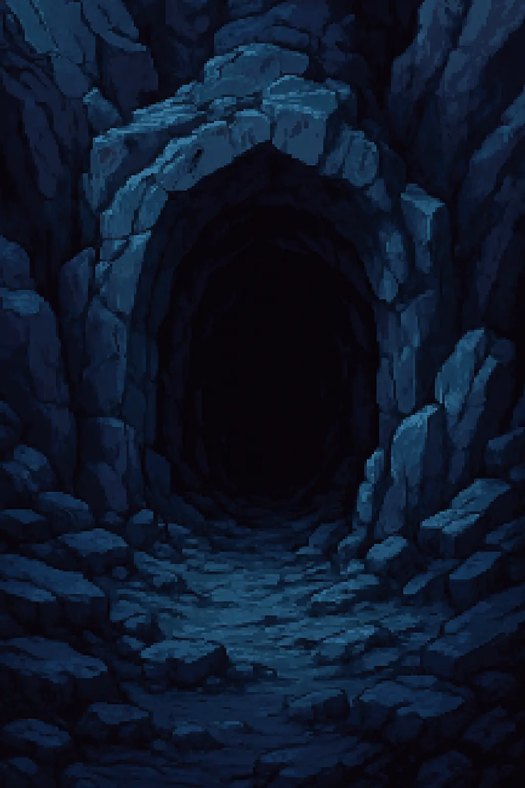

**Type de lieu** : Zone  
**Localisation** : Monts Terribles  
**Description** :
> Creusée dans la roche noire, la Grotte des Échos renvoie les moindres sons avec un étrange décalage, comme si d'autres
> voix répétaient vos paroles dans une langue oubliée. Les anciens mineurs disent qu’elle mène à un réseau souterrain
> encore inexploré, mais nul n’a osé aller au-delà des premiers boyaux.

| PNJs présents | Bâtiments |  
|---------------|-----------|  
| *(Aucun)*     | La Grotte |  

### 🏛️ La Grotte

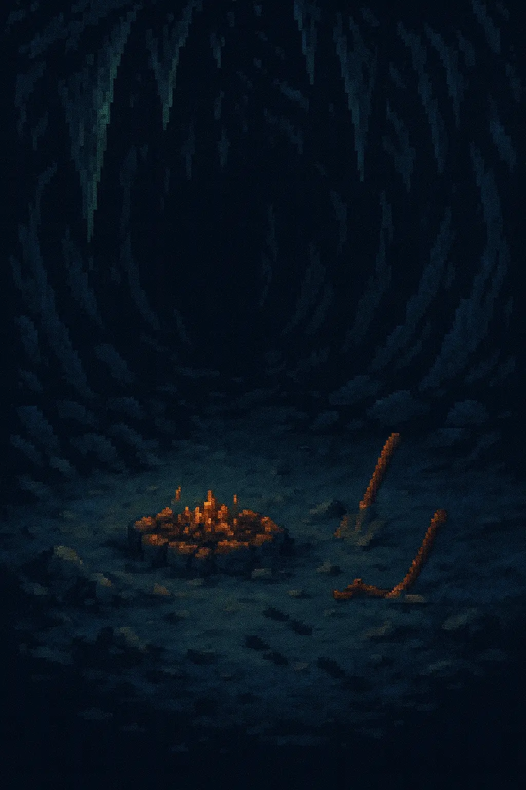

**Type de lieu** : Bâtiment  
**Localisation** : Grotte des Échos  
**Description** :
> Une vaste caverne aux parois noires, où la lumière peine à percer. Des stalactites pendent comme des crocs menaçants,
> et le sol est jonché de débris minéraux. Au centre, un feu de camp éteint, entouré de quelques outils rouillés et
> usés. Des traces de pas dans la poussière indiquent que d’autres sont passés par ici, et des bruits de pioche
> résonnent au fond, comme si quelqu’un continuait à travailler dans l’obscurité.

| PNJs présents | Pièces              |  
|---------------|---------------------|  
| *(Aucun)*     | Le Tunnel de Bardin |  

#### 🧱 Le Tunnel de Bardin

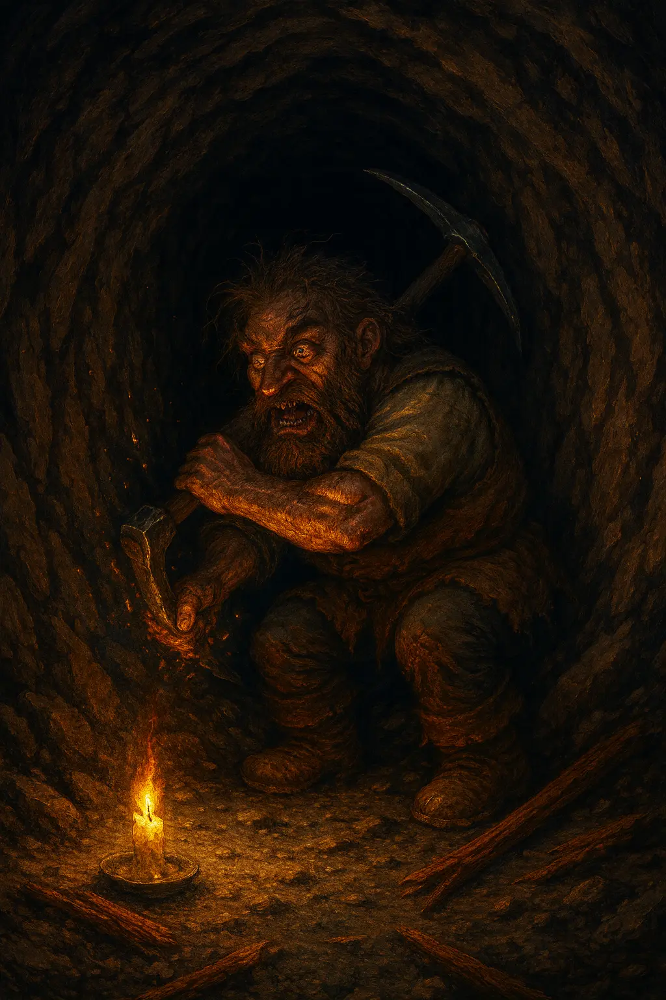

**Type de lieu** : Pièce  
**Localisation** : La Grotte  
**Description** :
> Un tunnel étroit creusé à la hâte, avec des marques de pioche récentes sur les parois. Le sol est jonché de
> débris minéraux et de morceaux de bois. Au fond du tunnel, un nain solitaire creuse, le visage marqué par
> l’effort et la fatigue. Il semble agité par une frénésie inquiétante, murmurant des mots incompréhensibles, comme s’il
> parlait à la pierre elle-même.

| PNJs présents   |  
|-----------------|  
| Bardin l'Exhumé |  

---

## 🗺️ Refuge du Bouc Boiteux

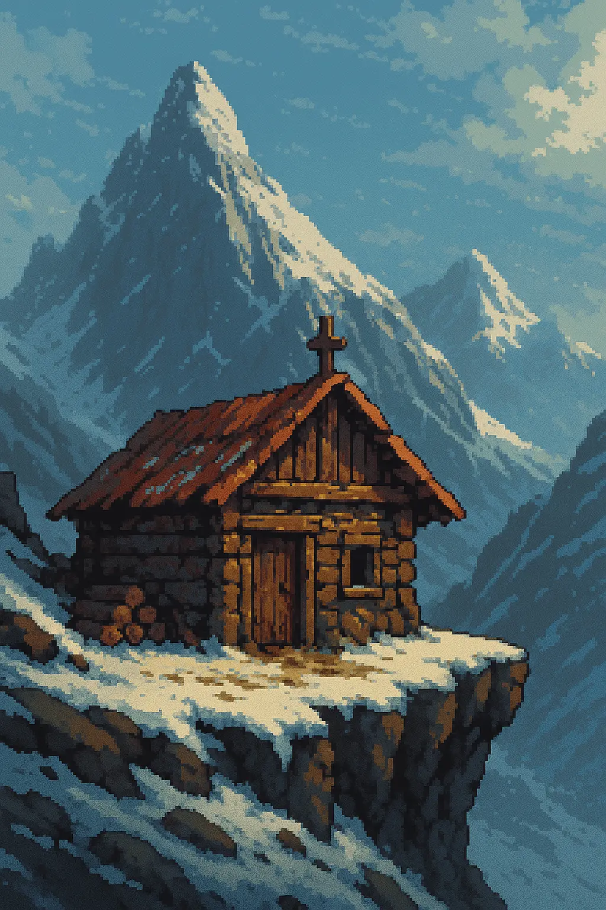

**Type de lieu** : Zone  
**Localisation** : Monts Terribles  
**Description** :
> Perché sur une corniche étroite, ce vieux refuge de chasseurs semble abandonné depuis des années. Pourtant, on y
> trouve toujours du bois sec et des restes de repas récents. Le soir, des traces de sabots solitaires apparaissent dans
> la neige devant la porte…  
> Le nom viendrait d’un animal de légende, gardien farouche des lieux.

| Créatures présentes | Bâtiments |  
|---------------------|-----------|
| Bouquetin Féroce    | Le Refuge |

### 🏛️ Le Refuge

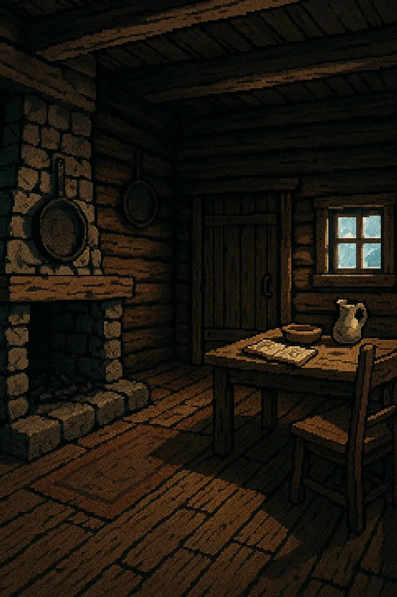

**Type de lieu** : Bâtiment  
**Localisation** : Refuge du Bouc Boiteux  
**Description** :
> Une unique pièce, simple et austère. Lit de bois contre le mur, table centrale avec une assiette sale, un bol fendu,
> une cuillère tordue. Au fond, un foyer de pierres noircies abrite des braises presque mortes. L’air sent le bois brûlé
> et l’oubli. Sur une chaise, un vieux manteau. Et sur la table, un carnet froissé, griffonné de mots confus.  
> Tout semble prêt à accueillir un voyageur… ou à témoigner d’un départ qu’on n’a jamais vraiment osé prendre.

| PNJs présents        | Pièces     |  
|----------------------|------------|  
| Tharôl le Silencieux | *(Aucune)* |  

---

## 🗺️ Gouffre d’Askalor

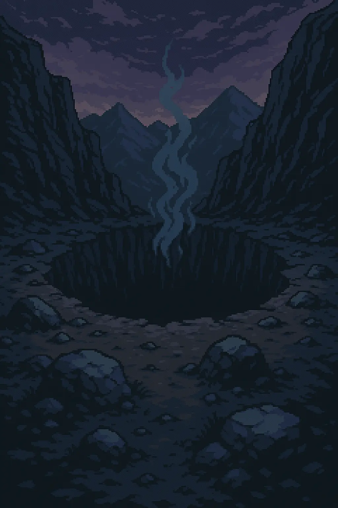

**Type de lieu** : Zone  
**Localisation** : Monts Terribles  
**Description** :
> Un immense puits naturel, béant au cœur des Monts Terribles, réputé sans fond. On y jetait autrefois des offrandes,
> selon les superstitions et les croyances, pour calmer ce qui s'y terrait. Le vent qui remonte du gouffre ressemble à
> un souffle… ou à un râle.  
> On chuchote qu’Askalor y dort toujours, tapi dans l’obscurité.

| PNJs présents | Bâtiments  |  
|---------------|------------|  
| *(Aucun)*     | Le Gouffre |  

### 🏛️ Le Gouffre

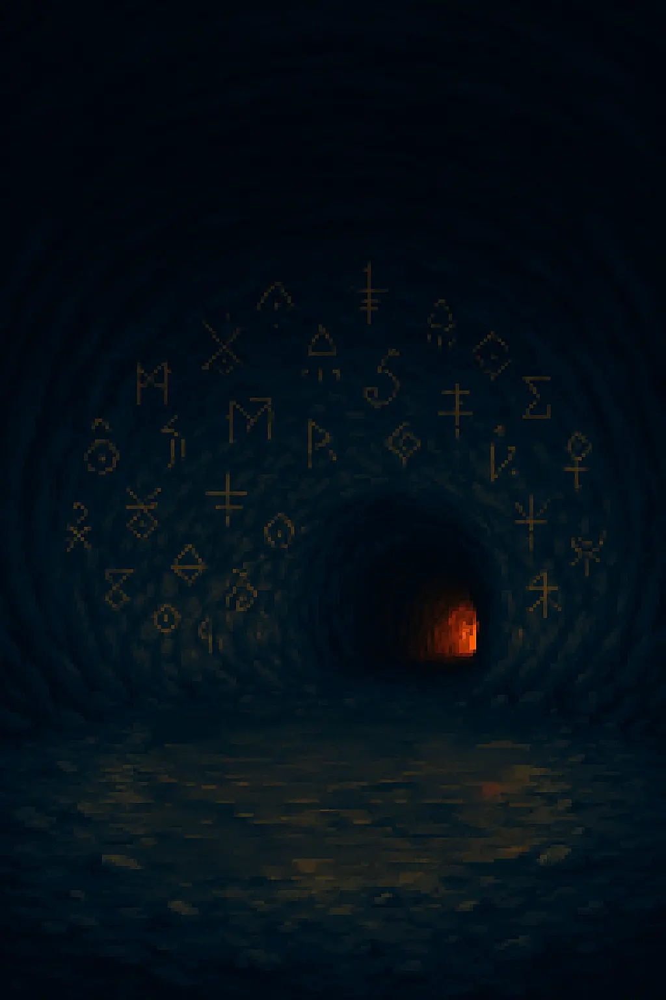

**Type de lieu** : Bâtiment  
**Localisation** : Gouffre d’Askalor  
**Description** :
> Une vaste caverne circulaire, aux parois lisses et sombres, où la lumière peine à atteindre les bords. Au fond, un
> tunnel qui ne semble pas très profond, d'où émane une chaleur étrange. Des traces de rituels anciens sont visibles sur
> les murs, des symboles gravés à la hâte. L’air est lourd, chargé d’une odeur de soufre et de poussière.

| Créatures présentes | Pièces               |  
|---------------------|----------------------|  
| ???                 | La Chambre du Rituel |  

#### 🧱 La Chambre du Rituel

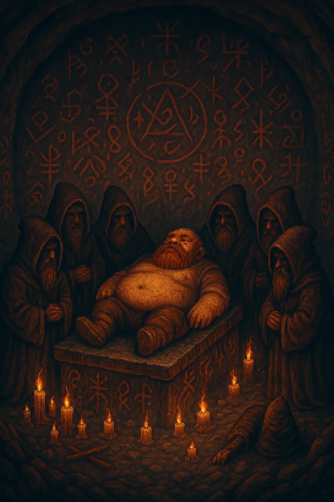

**Type de lieu** : Pièce  
**Localisation** : Le Gouffre  
**Description** :
> Une petite alcôve au fond du gouffre, où les murs sont couverts de symboles étranges et de runes anciennes. Au centre,
> un autel de pierre noircie par le temps, entouré de bougies allumées, sur lequel repose un nain gros et gras. Il
> semble à demi conscient, apparemment endormi, ou drogué. L’air est chargé d’une énergie palpable, comme si le lieu
> était imprégné de magie ancienne.  
> Tout autour de l'autel, un groupe de nains encapuchonnés murmure des incantations dans une langue oubliée,
> leurs visages cachés dans l’ombre. Ils semblent en transe, comme s'ils communiaient avec une puissance
> ancienne et terrifiante. Vous entendez comme des murmures dans la pièce, une voix rauque et profonde qui
> résonne dans votre esprit, vous invitant à vous approcher de l'autel.

| PNJs/Créatures présents            |  
|------------------------------------|  
| Nains du Culte de l'Âtre Souverain |  
| ???                                |  

---

## 🗺️ Rocher du Dragon

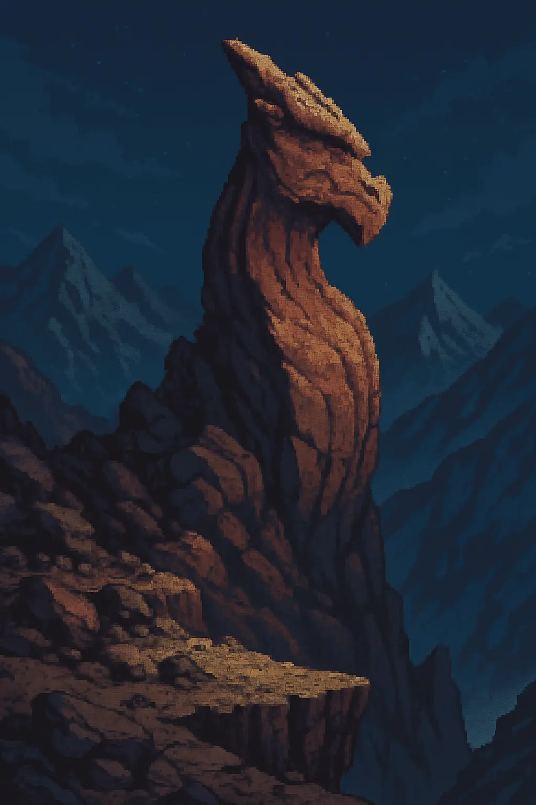

**Type de lieu** : Zone  
**Localisation** : Monts Terribles  
**Description** :
> Dressé comme une griffe géante plantée dans la montagne, le Rocher du Dragon surplombe un précipice silencieux. Les
> anciens disent qu’un dragon de pierre y sommeille depuis des siècles, figé dans la roche par un antique sortilège.
> Parfois, la nuit, des grondements résonnent dans les falaises…  
> Certains aventuriers affirment avoir vu des écailles briller sous la lune, d’autres n’en sont jamais revenus.

| PNJs présents | Bâtiments |  
|---------------|-----------|  
| *(Aucun)*     | *(Aucun)* |  
