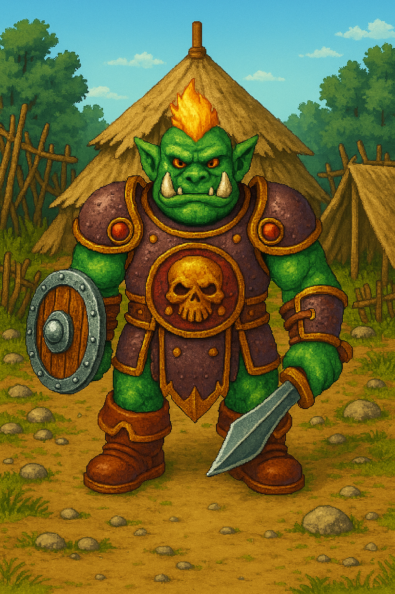

# 🧍‍♂️ Fiche PNJ : Chef Gobelin

**Type de PNJ** : Créature humanoïde - Gobelin  
**Localisation** : Bois des Relents – Campement Gobelin  
**Description** :
> Le Chef Gobelin est une silhouette trapue et râblée, couverte de colifichets étranges et de cicatrices mal refermées.
> Sa voix rauque ponctuée de raclements de gorge est aussi agressive que moqueuse, et son regard perçant ne laisse rien
> passer.  
> Menaçant par habitude plus que par nature, il dirige sa petite bande avec une théâtralité presque comique, entre
> rodomontades bravaches et accès de mauvaise foi. Mais derrière le ton bourru se cache une intelligence rusée, capable
> de reconnaître un bon accord ou un humain digne de respect.  
> Il parle par métaphores mal dégrossies, avec un humour brut et des expressions inventives à base de «
> gross’bottes », « face de crevette » ou « p’tit moustique ». Selon les choix du joueur, il peut devenir un adversaire
> féroce ou un allié surprenant — capable de négocier la paix, d’offrir des objets rares ou même de révéler des indices
> cruciaux sur des événements bien plus vastes que son camp forestier.

---

## 💬 Interactions

| Interaction                        | Rôle       |
|------------------------------------|------------|
| Rencontre menaçante                | Ambiance   |
| Négociation sur la livraison       | Quête      |
| Déclenche un combat                | Combat     |
| Offre un anneau d'invisibilité     | Récompense |
| Révèle un indice sur le Donjon     | Lore       |
| Commente la paix avec les pêcheurs | Épilogue   |

---

## 📜 Quêtes associées

| Quête                  | Rôle        | Détails                                                           |
|------------------------|-------------|-------------------------------------------------------------------|
| Les Disparus du Donjon | Informateur | Révèle un indice clé sur un homme mystérieux croisé dans la forêt |
| Livraison en cours     | Obstacle    | Propose un affrontement ou une négociation                        |
| Livraison en cours     | Récompense  | Donne un anneau magique si le joueur réussit la médiation         |
