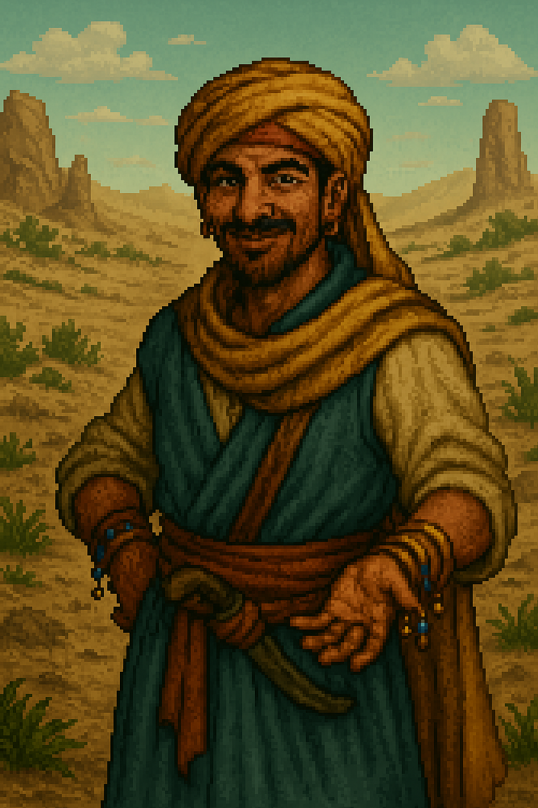

# 🧍‍♂️ Fiche PNJ : Farouk le Nomade

**Type de PNJ** : Marchand errant  
**Localisation** : Sables Chauds – Camp Abandonné  
**Description** :
> Un homme à la peau tannée par le vent, vêtu de tissus légers mais savamment noués. Des colifichets brillants pendent à
> ses poignets et un sourire rusé flotte constamment sur ses lèvres.  
> Farouk a l’œil de celui qui a traversé bien des tempêtes… et survécu à toutes. Il vous jauge d’un regard
> professionnel, à mi-chemin entre le commerçant et l’escroc bienveillant.  
> Bavard, charmeur, toujours à la limite du mystère, il semble tout savoir sur ce qui circule — ou disparaît — dans le
> désert. Il vend des objets, des informations, des légendes… et parfois, sans prévenir, il vous mettra sur la piste
> d’un secret plus grand encore.  
> Il est à la croisée des chemins : entre folklore et vérité, entre quête et contrebande.

---

## 💬 Interactions

| Interaction                               | Rôle        |
|-------------------------------------------|-------------|
| Présentation théâtrale                    | Ambiance    |
| Donne la piste du voleur                  | Enquête     |
| Indique l’Oasis Sans Nom                  | Exploration |
| Propose (ou refuse) l’entrée en quête     | Déclencheur |
| Fait des commentaires en cours de quête   | Suivi       |
| Partage une rumeur sur la Crique du Pendu | Exploration |
| Évoque un passé trouble avec un miroir    | Ambiguïté   |

---

## 📜 Quêtes associées

| Quête                 | Rôle        | Détails                                                                   |
|-----------------------|-------------|---------------------------------------------------------------------------|
| La Fiole Perdue       | Informateur | Révèle la localisation de l’Oasis Sans Nom                                |
| Le Jugement du Cercle | Déclencheur | Par un ragot énigmatique, lance la quête liée à la Crique du Pendu        |
| Le Jugement du Cercle | Témoin      | Livresque ou sincère, partage un souvenir mystérieux à propos d’un miroir |
