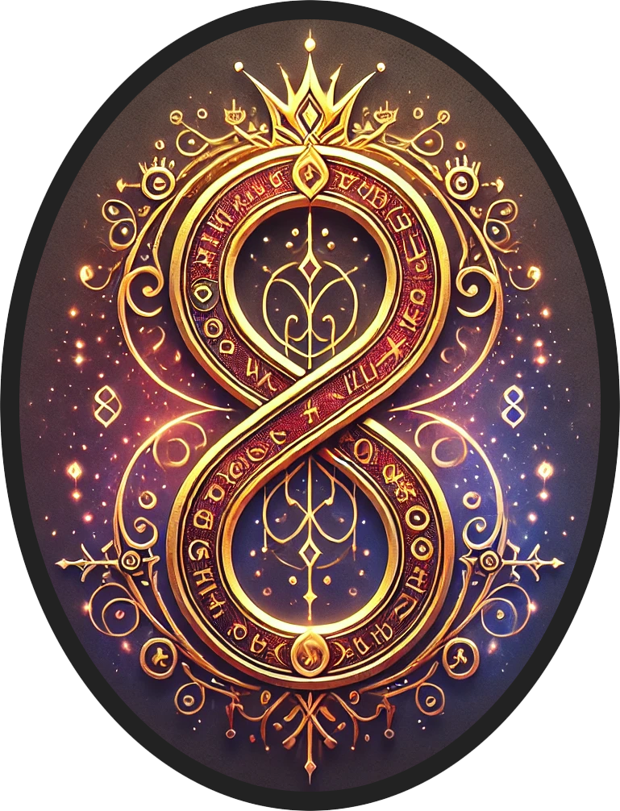

# 🎮 Présentation du jeu : *Les Huit Royaumes – Chapitre I : L’Éveil*

**Type de jeu** : Jeu de rôle narratif, à choix multiples  
**Format** : Exploration écran par écran, à la manière d’un *Livre dont vous êtes le Héros*  
**Univers** : Médiéval-fantastique sombre et poétique  
**Plateforme** : Navigateur web (expérience solo)  
**Statut** : Chapitre I jouable – prototype

---

## ✨ Synopsis

> Lorsque le joueur ouvre les yeux, c’est dans un monde qui l’a oublié. L’ancien royaume s’est fragmenté, le Roi a
> disparu, et la mémoire collective s’effrite lentement. Dans cette brume d’oubli, une vérité oubliée cherche à
> émerger :
> celle du Donjon de l’Âme, des sceaux brisés… et du dernier espoir des Huit Royaumes.

Vous incarnez un personnage sans passé, guidé par des choix, des rencontres et des fragments de vérité. Chaque lieu,
chaque décision, chaque interaction peut révéler une pièce du grand puzzle.  
À la croisée des dialogues, des combats, des objets et des secrets, vous forgez peu à peu votre propre légende.

---

## 🎯 Objectifs narratifs

- **Explorer** un monde fragmenté, habité par des PNJ riches, des lieux singuliers et des secrets enfouis.
- **Reconstituer** la mémoire du royaume à travers des quêtes, documents, objets anciens et témoignages contradictoires.
- **Interagir** avec un système de dialogues dynamiques où vos choix influencent les quêtes, la réputation et les
  révélations.
- **Accomplir** des quêtes principales et secondaires ancrées dans la narration, le mystère et les dilemmes moraux.
- **Faire évoluer votre Personnage** à travers des choix significatifs, des objets interactifs et des interactions avec
  les PNJs.

---

## 🧩 Caractéristiques principales

| Mécanique                   | Détails                                                                |
|-----------------------------|------------------------------------------------------------------------|
| Système de quêtes ramifiées | Avec embranchements, étapes optionnelles, et conséquences différées    |
| Dialogues conditionnels     | Débloqués selon objets, réputation, progression, ou choix antérieurs   |
| Combats tactiques           | Initiés dans certaines zones, en fonction de la narration ou du hasard |
| Exploration progressive     | Accès progressif à de nouvelles zones selon vos actions et découvertes |
| Objets interactifs uniques  | Clés de lecture du monde, révélateurs de vérité ou déclencheurs cachés |

---

## 🗺️ Zones accessibles dans le Chapitre I

- **Port Saint-Doux** : point de départ du joueur, ville portuaire à l’équilibre précaire
- **Plouc** : village rural, témoin de la vie quotidienne et des traditions oubliées
- **Bois des Relents** : forêt mystérieuse, refuge de créatures étranges
- **Bois du Pendu** : forêts hantées par des présences druidiques et des mystères anciens
- **Sables Chauds** : désert aux mirages trompeurs, théâtre de quêtes ésotériques
- **Monts Terribles** : terres d’isolement où se cachent des fragments du passé royal
- **Donjon de l'Âme** : lieu central de l’intrigue, gardien de secrets oubliés

---

## 📜 Chapitre I : L’Éveil

> Ce premier chapitre pose les fondations de l’univers.  
> Le joueur y découvre la rumeur du Donjon de l’Âme, rencontre les survivants de l’ancien pouvoir, et explore les
> premières zones majeures.  
> Les décisions prises ici auront un impact dans les chapitres suivants — même les plus anodines.

---

## 🧪 Avancement & ambitions

- **Chapitre I (prototype)** : intégration complète du Rpyaume de l'Île du Nord, PNJ et quêtes secondaires et majeure
- **Chapitre I (en projet)** : développement d'une application full mobile, amélioration de l'interface et de
  l'expérience utilisateur
