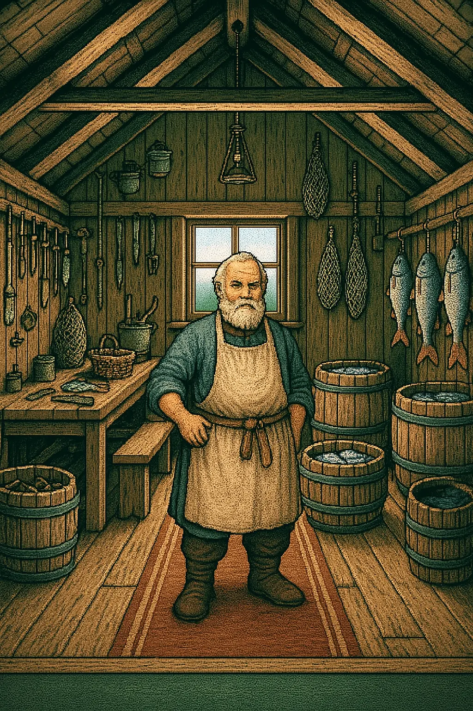

# 📍 Fiche Lieu : Plouc

**Type de lieu** : Village  
**Localisation** : Royaume de l’Île du Nord  
**Description** :
> Le village de pêcheurs de Plouc est un endroit reculé, situé à quelques lieues de Port Saint-Doux.  
> Les habitants, simples et rustiques, vivent de la pêche et de la chasse, loin de l'agitation de la capitale.  
> Les maisons en bois et en torchis s'alignent le long de la côte, où un semblant d'embarcadère semble servir de port de
> pêche.  
> Les villageois vous regardent d'un air méfiant, et s'en remettent à leurs occupations.

### 🏛️ Maison de Gérard le Pêcheur

**Type de lieu** : Bâtiment  
**Localisation** : Plouc  
**Description** :
> Cette bicoque en bois est la maison de Gérard, un pêcheur du village de Plouc.  
> Les murs sont couverts de filets de pêche et de trophées de pêche, et une odeur de poisson rance flotte dans l'air.

| PNJs présents     | Pièces     |  
|-------------------|------------|  
| Gérard le Pêcheur | *(Aucune)* |  
