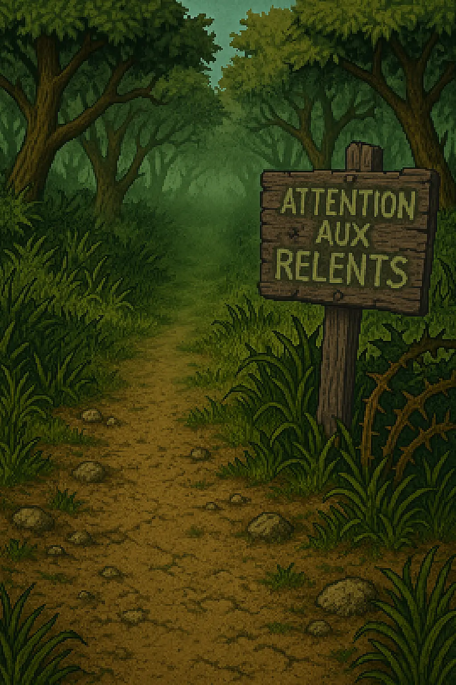
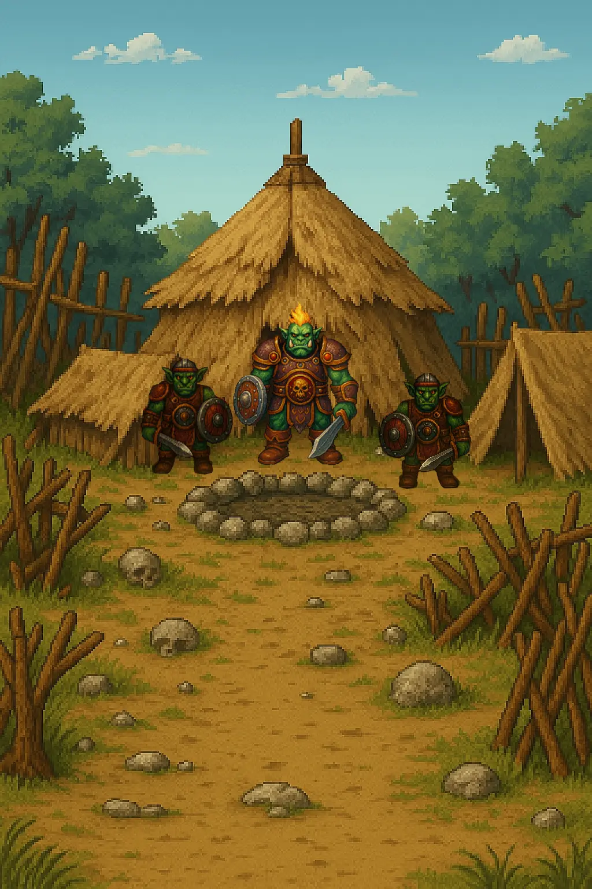

# 📍 Fiche Lieu : Bois des Relents

**Type de lieu** : Forêt  
**Localisation** : Royaume de l’Île du Nord  
**Description** :
> Malgré sa canopée clairsemée et ses sentiers paisibles, une odeur tenace flotte dans l’air du Bois des Relents —
> mélange déroutant de terre détrempée, de mousse pourrissante et de quelque chose d’indéfinissable… comme un vieux
> souvenir oublié dans un coin humide.
> Les habitants de Plouc évitent ces bois dès que le vent tourne, murmurant que les miasmes qui s’en échappent ne sont
> pas tous naturels. Certains disent qu’un ancien marais s’étend sous la surface, d’autres parlent de créatures tapies,
> à l’origine de ces relents peu engageants.

---

## 🗺️ Orée du Bois

**Type de lieu** : Zone  
**Localisation** : Bois des Relents  
**Description** :
> Ici, les champs mal entretenus de Plouc s'effilochent peu à peu pour laisser place à une végétation plus anarchique.
> Les buissons sont griffus, les arbres penchent comme s’ils chuchotaient des secrets nauséabonds, et l’air devient plus
> lourd à chaque pas.
>
> Un vieux panneau à moitié mangé par les termites porte l’inscription « Attention aux relents », maladroitement
> repeinte par une main anonyme. Le sol est encore sec, mais une humidité étrange s’infiltre déjà dans les bottes.
>
> Ce n’est que le début, et pourtant, on comprend vite que le cœur du bois ne sera pas accueillant.

| Créatures présentes | Bâtiments |  
|---------------------|-----------|  
| Éclaireurs Gobelins | *(Aucun)* |  

---

## 🗺️ Campement gobelin

**Type de lieu** : Zone  
**Localisation** : Bois des Relents  
**Description** :
> Une odeur âcre flotte dans l’air, mélange de cendres froides, de viande tournant sous les braises, et de bêtes mal
> lavées. Devant vous, le campement gobelin s’étale comme une verrue sur la clairière : des barricades grossières,
> faites
> de branchages entremêlés, encore garnis de feuilles mortes, dessinent un cercle irrégulier autour de plusieurs tentes
> à
> moitié effondrées.
>
> Une tente plus grande, couverte de peaux mal tannées et entourée de deux guerriers gobelins à l'air nerveux, trône au
> centre, flanquée d’un feu de camp aux flammes rougeoyantes, parmi quelques ossements.
>
> Tout respire la précarité, le bricolage et l’urgence. Des tas d’immondices s’accumulent entre les tentes, et on entend
> au loin le couinement nerveux d’une créature attachée.

| PNJs présents | Bâtiments |  
|---------------|-----------|  
| Chef Gobelin  | *(Aucun)* |  
