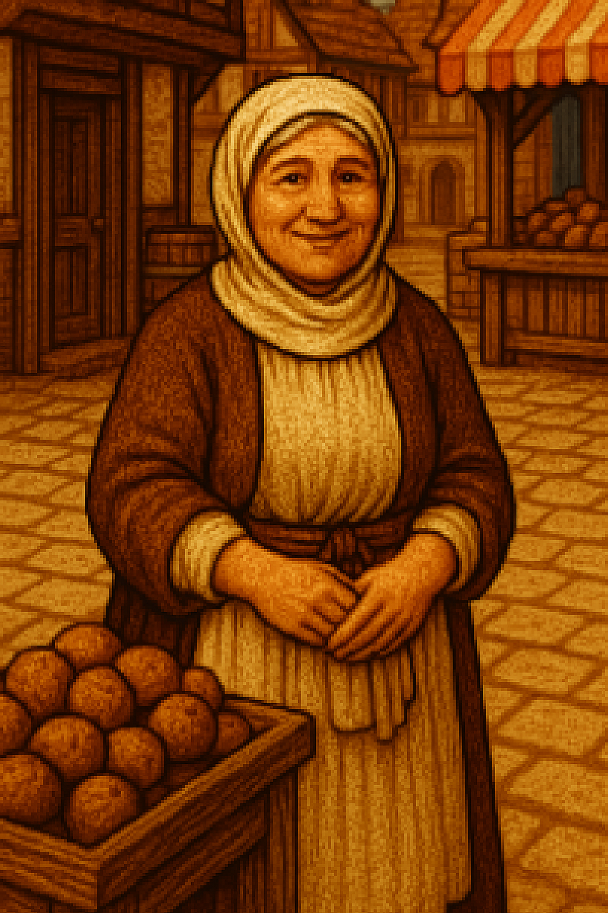

# 🧍‍♀️ Fiche PNJ : Sophie la Marchande

**Type de PNJ** : Marchande  
**Localisation** : Port Saint-Doux – Quartier du Marché  
**Description** :
> Sophie est une commerçante bien connue du quartier du Marché. Pipelette sincère et croyante anxieuse, elle garde le
> sourire malgré les bouleversements récents dans la ville. Très attachée à l’ordre établi, elle parle souvent du Roi et
> du Maire avec émotion ou résignation. Elle croit aux vertus de la prière, et glisse parfois un ragot dans ses propos,
> entre deux conseils pratiques.
> Son ton est souvent pressé, mais pas désagréable — une sorte de franchise rustique qui fait partie du décor du marché.
> Elle garde l’œil sur ses marchandises, mais n’hésite jamais à donner une information… surtout si elle peut en tirer un
> petit avantage.

---

## 💬 Interactions

| Interaction                           | Rôle        |
|---------------------------------------|-------------|
| Achète et vend des babioles           | Commerçant  |
| Parle du Quartier de la Vieille Ville | Exploration |

---

## 📜 Quêtes associées

| Quête      | Rôle      |
|------------|-----------|
| *(Aucune)* | *(Aucun)* |

