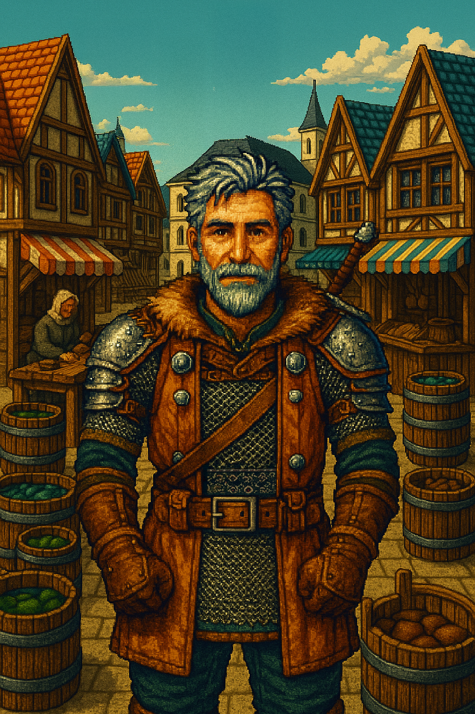

# 🧍‍♂️ Fiche PNJ : Robert le Garde

**Type de PNJ** : Garde  
**Localisation** : Port Saint-Doux – Quartier du Marché  
**Description** :
> Robert est l’un des gardes les plus anciens et les plus respectés de Port Saint-Doux. Raide comme une épée, peu
> loquace, mais jamais totalement fermé, il incarne la rigueur militaire… à sa manière. Il se méfie de tout le monde, y
> compris des citoyens les plus innocents, et n’accorde sa confiance qu’avec parcimonie.
> Sous sa carapace de discipline se cache un homme encore loyal au Roi disparu, révolté par les manigances politiques et
> hanté par les secrets du passé. Lorsqu’il parle, c’est souvent en grognant, avec une franchise un peu brute, mais
> toujours chargée de bon sens. Il est une source d’information fiable — pour ceux qui prennent le temps de gagner son
> respect.

---

## 💬 Interactions

| Interaction                | Rôle        |
|----------------------------|-------------|
| Renvoie le joueur promener | Ambiance    |
| Parle des Docks de l’Ouest | Exploration |

---

## 📜 Quêtes associées

| Quête                  | Rôle        | Détails                          |
|------------------------|-------------|----------------------------------|
| Les Disparus du Donjon | Informateur | Parle des notes de Galdric Ier   |
| Bagarre bizarre        | Donneur     | Déclenche et récompense la quête |
