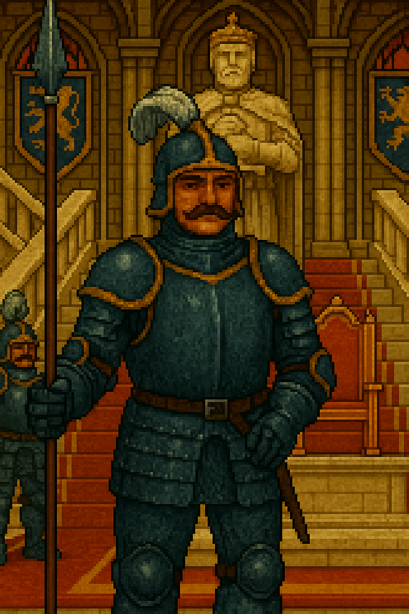

# 🧍‍♂️ Fiche PNJ : Garde du Palais

**Type de PNJ** : Garde  
**Localisation** : Port Saint-Doux – Quartier des Chauves - Palais Royal  
**Description** :
> Casque à plume, moustache taillée au cordeau et lance toujours prête, le garde du palais incarne la discipline et la
> loyauté. Il ne rit jamais, ne parle que par monosyllabes, et considère que laisser passer un inconnu sans autorisation
> est un crime passible d’exécution. Il n’est peut-être pas très fin, mais il frappe droit.

---

## 💬 Interactions

| Interaction                            | Rôle    |
|----------------------------------------|---------|
| Refuse l'accès aux Appartements Royaux | Blocage |

---

## 📜 Quêtes associées

| Quête                  | Rôle       | Détails                                |
|------------------------|------------|----------------------------------------|
| Les Disparus du Donjon | Opposition | Refuse l’accès aux appartements royaux |
